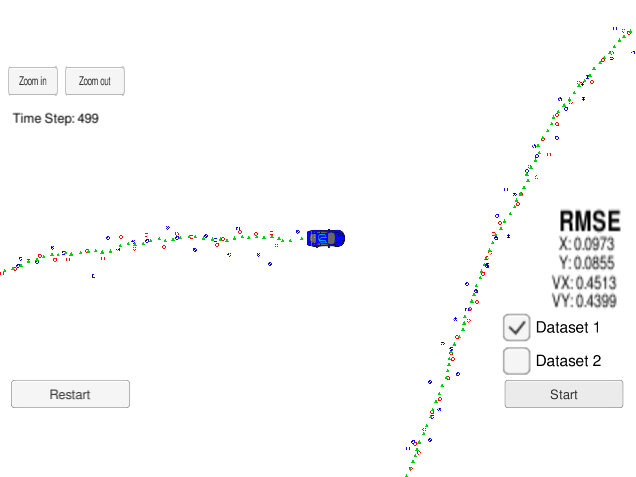
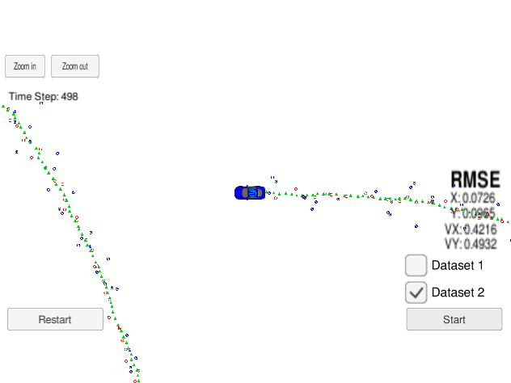

# Extended Kalman Filter

This project implements an Extended Kalman Filter with C++. A simulator provided by Udacity (it could be downloaded here) generates noisy RADAR and LIDAR measurements of the position and velocity of an object, and the Extended Kalman Filter must use those measurements to predict the position of the object. 

The code presented here is designed to work with the Udacity term 2 simulation software. The Term 2 Simulator which can be downloaded [here](https://github.com/udacity/self-driving-car-sim/releases)

This repository includes two files that can be used to set up and install [uWebSocketIO](https://github.com/uWebSockets/uWebSockets) for either Linux or Mac systems. For windows you can use either Docker, VMware, or even [Windows 10 Bash on Ubuntu](https://www.howtogeek.com/249966/how-to-install-and-use-the-linux-bash-shell-on-windows-10/) to install uWebSocketIO. Please see the uWebSocketIO Starter Guide page in the classroom within the EKF Project lesson for the required version and installation scripts.

## Other Important Dependencies

* cmake >= 3.5
  * All OSes: [click here for installation instructions](https://cmake.org/install/)
* make >= 4.1 (Linux, Mac), 3.81 (Windows)
  * Linux: make is installed by default on most Linux distros
  * Mac: [install Xcode command line tools to get make](https://developer.apple.com/xcode/features/)
  * Windows: [Click here for installation instructions](http://gnuwin32.sourceforge.net/packages/make.htm)
* gcc/g++ >= 5.4
  * Linux: gcc / g++ is installed by default on most Linux distros
  * Mac: same deal as make - [install Xcode command line tools](https://developer.apple.com/xcode/features/)
  * Windows: recommend using [MinGW](http://www.mingw.org/)

## Build Instructions

Make sure you have the simulator running before this step.

1. Clone this repo.
2. Make a build directory: `mkdir build && cd build`
3. Compile: `cmake .. && make` 
   * On windows, you may need to run: `cmake .. -G "Unix Makefiles" && make`
4. Run it: `./ExtendedKF `

You can also debug the code from Eclipse CDT. In order to be imported to Eclipse CDT, from root of project, run the below command to create CDT project files.

cmake -G "Eclipse CDT4 - Unix Makefiles" -D CMAKE_BUILD_TYPE=Debug .

After that import to CDT as existing code and you can debug the C++ code from linux environment.

## Results
Here is the simulator final state after running the EKL with dataset 1:

Here is the simulator final state after running the EKL with dataset 2:

The Red circles are lidar measurements.
The Blue circles are radar measurements.
The Green markers are the car's position as estimated by the Kalman filter.

